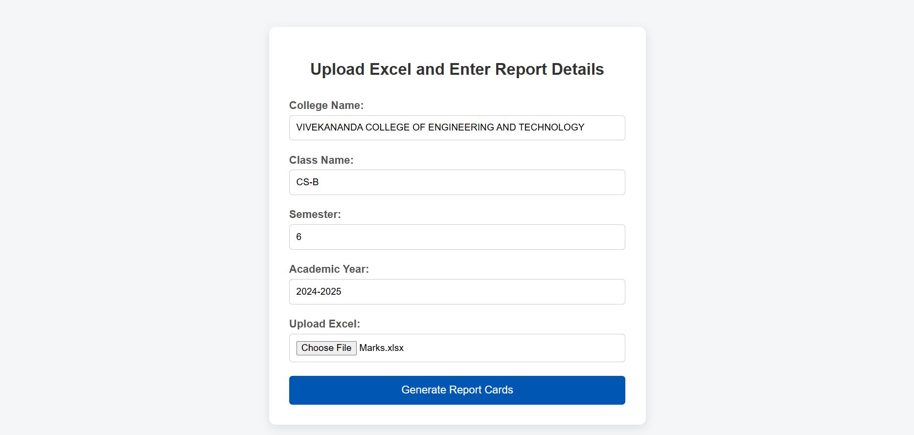

# 📄 Report Card Generator

The **Report Card Generator** is a Python-based application designed to automate the creation of professional academic report cards using student data provided in Excel format. The system simplifies the traditional manual process by generating accurate, consistent, and printable PDF report cards efficiently.

---

## 🚀 Features

- Bulk processing of student records from Excel files
- Manual entry of academic details such as:
  - College Name
  - Class Name
  - Semester
  - Academic Year
- Automatic calculation of:
  - Total marks
  - Percentage
  - Grade
  - Pass/Fail status
- Professional PDF report card generation
- Flexible handling of Excel files with varying column structures
- Clean and well-organized folder structure

---

## 🛠️ Technologies Used

- **Python**
- **Pandas** – for Excel data processing
- **PDF generation libraries** – for professional report card creation
- **Git & GitHub** – for version control and hosting

---

## 📁 Project Folder Structure
Report-Card-Generator/
│
├── src/ # Python source code
├── input/ # Excel files uploaded by user
├── output/ # Generated PDF report cards
├── templates/ # PDF/CSS templates (if any)
├── requirements.txt # Required Python libraries
└── README.md # Project documentation


---

## ⚙️ Installation & Setup

1. Clone the repository:
   ```bash
   git clone https://github.com/radhuankolekar/Report-Card-Generator.git

2. Navigate to the project folder:

cd Report-Card-Generator

3. Install required dependencies:

pip install -r requirements.txt

---

## How to Run the Project

python report_card.py

### 📝 User Input (College & Academic Details)


### 📄 Generated PDF Report Card


### PDF review


